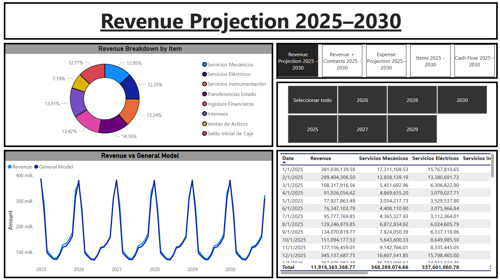
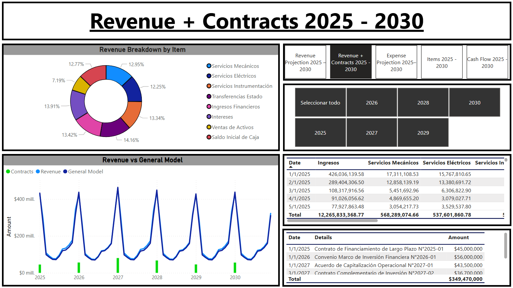
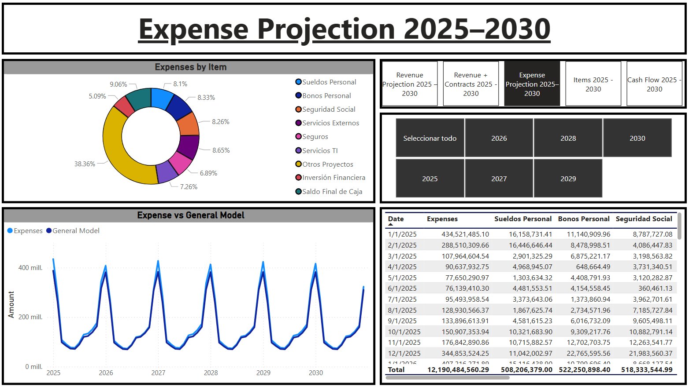
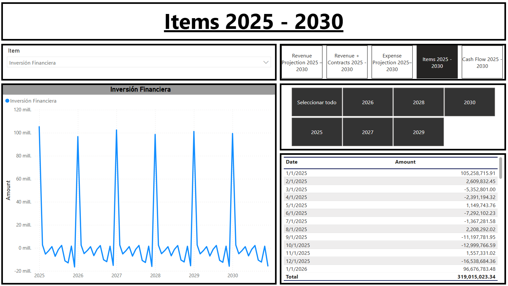
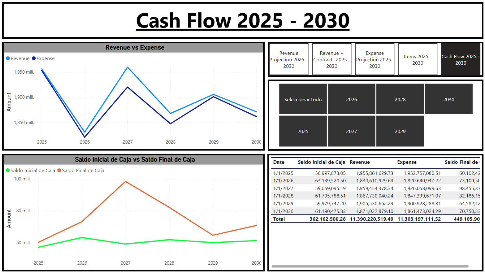

# 📊 Financial Forecasting Engine  
### Corporate Financial Projection & Planning System

---

## 📌 Overview

**Financial Forecasting Engine** is an automated financial projection system designed to estimate revenue, expenses, and cash flow for a fictitious company over the 2025–2030 period.

The project implements advanced econometric time series models, automatically selecting the best methodology according to the statistical characteristics of each financial variable.

The objective is to simulate a real-world corporate financial planning environment, where revenue forecasting, cost estimation, and liquidity analysis are critical for strategic decision-making.

---

## 🎯 Project Objectives

- Automate financial forecasting using econometric models.
- Evaluate multiple time series methodologies and select the most suitable per financial item.
- Build a structured financial statement compatible with corporate analysis.
- Generate projected cash flow estimates.
- Visualize results through an interactive Power BI dashboard.

---

## ⚙️ Methodology

The project was developed in Python and structured into five major stages:

### 1️⃣ ETL (Data Cleaning & Transformation)

- Historical data cleansing.
- Format restructuring.
- Dataset preparation compatible with forecasting libraries.

---

### 2️⃣ Econometric Modeling

The following time series models were implemented:

- ARIMA / SARIMA (AutoARIMA)
- Holt-Winters
- AutoCES
- AutoTheta
- Seasonal Naive

For the general financial model, `auto_arima` was used, optimizing parameters based on AIC and BIC criteria.

For item-level forecasts, cross-validation was implemented using MSE (Mean Squared Error) as the evaluation metric to determine the best-performing methodology.

---

### 3️⃣ Financial Projection (2025–2030)

- 18 individual models were generated (8 revenue streams and 10 expense categories).
- 95% confidence intervals were computed.
- 72 monthly periods (6 years) were forecasted.

---

### 4️⃣ Financial Statement Reconstruction

- Integration of general and item-level forecasts.
- Restructuring into a corporate financial format.
- Asset sales calculation based on accumulated financial investments.

---

### 5️⃣ Cash Flow Computation

The following financial identity was applied:

$$\text{Final Cash Balance} = \text{Initial Cash Balance} + \text{Revenue} - \text{Expenses}$$

This resulted in projected cash flow estimates for the 2025–2030 period.

Currently, the cash flow is presented in an annual consolidated format.

---

## 🧩 Project Architecture

The system follows a modular structure:

- **controllers.py** → Global configuration and hyperparameters.
- **data_builder.py** → ETL processes and dataset structuring.
- **forecasting.py** → Model generation and evaluation.
- **financials.py** → Final financial statement reconstruction.
- **cashflow.py** → Cash flow generation.
- **main.py** → Full pipeline orchestration and output export.

This architecture enables scalability and adaptability to different financial planning scenarios.

---

## 📚 Libraries Used

### Data Processing
- numpy  
- pandas  

### Econometrics & Forecasting
- pmdarima  
- statsforecast  
- utilsforecast  

### Implemented Models
- HoltWinters  
- AutoCES  
- AutoARIMA  
- AutoTheta  
- SeasonalNaive  

### Supporting Libraries
- matplotlib  
- pathlib  
- warnings  

---

## 📊 Interactive Dashboard (Power BI)

An interactive corporate dashboard was developed to visualize:

- Revenue projections
- Expense projections
- Item-level analysis
- Contract-based revenue
- Projected cash flow

🔗 **Access the interactive dashboard:**  
👉 **[View Interactive Financial Dashboard](https://app.powerbi.com/view?r=eyJrIjoiZmQyZDQ4ODktNGU4Ni00OWJlLWE5M2EtNGM0NTFjNzlkOTI4IiwidCI6IjZmZDQ4ZjQxLWFmODEtNDVhNS05YzFlLWUzOTkwYmMyN2U3YyIsImMiOjR9)**

---

## 📸 Dashboard Preview

### 📈 Revenue Projection 2025–2030

---

### 🤝 Revenue + Contracts

---

### 📉 Expenses Projection

---

### 📊 Item-Level Analysis

---

### 💰 Cash Flow Projection

---

## 📈 Corporate Value

This system simulates a real corporate financial planning environment, enabling:

- Long-term financial sustainability analysis.
- Liquidity forecasting.
- Seasonal revenue and expense behavior evaluation.
- Data-driven strategic decision support.

Although the dataset is fictitious, the methodology is fully transferable to real corporate environments.

---

## 🔮 Future Improvements

The project can evolve into a more advanced financial planning system through:

- Implementation of monthly (instead of annual) cash flow projections.
- Scenario analysis (baseline, optimistic, pessimistic).
- Simulation of financial shocks or macroeconomic variations.
- Automated integration with enterprise databases.
- Additional model evaluation metrics (MAE, RMSE, MAPE).
- Full pipeline automation for scheduled execution.

---
